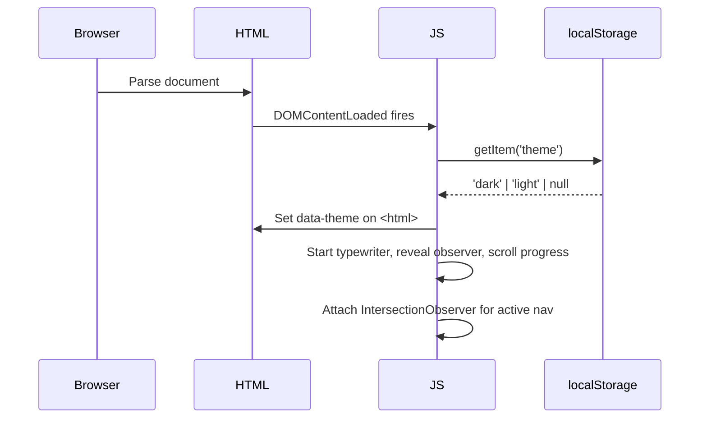
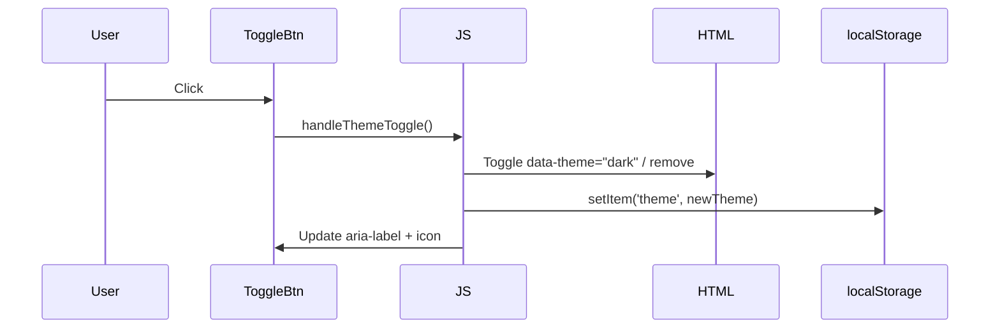
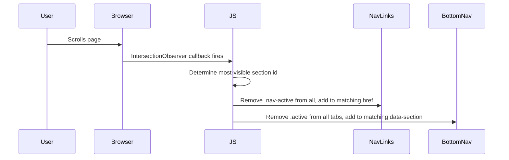

# Design Document: Portfolio Redesign

## Overview

A full visual and functional redesign of Ansh Vaghela's personal portfolio site (`index.html` / `style.css` / `script.js`) — pure HTML, CSS, JavaScript, no frameworks. The redesign modernises the colour system, removes the duplicate Gallery section, adds dark/light mode, a scroll-progress bar, a mobile bottom navigation bar, improved Skills layout, active nav highlighting, better hover effects, and a polished footer with a dynamic copyright year.

The goal is a premium, sharp, modern feel that still loads fast and requires zero build tooling.

---

## Architecture

The site remains a single-page document. All changes are additive or in-place replacements — no new files are strictly required, though a `theme.js` helper can be extracted if desired.

```mermaid
graph TD
    HTML[index.html<br/>Structure + Markup] --> CSS[style.css<br/>Design Tokens + Layout]
    HTML --> JS[script.js<br/>Behaviour + Interactivity]

    subgraph "New JS responsibilities"
        JS --> TM[Theme Manager<br/>dark/light toggle + localStorage]
        JS --> SP[Scroll Progress<br/>requestAnimationFrame bar]
        JS --> AN[Active Nav<br/>IntersectionObserver per section]
        JS --> BN[Bottom Nav<br/>mobile tab highlight sync]
        JS --> TY[Typewriter<br/>existing, unchanged]
        JS --> RV[Reveal Observer<br/>existing, unchanged]
    end

    subgraph "New CSS responsibilities"
        CSS --> DT[Design Tokens<br/>:root light + [data-theme=dark]]
        CSS --> SP2[Scroll Progress Bar<br/>fixed top element]
        CSS --> BN2[Bottom Nav Bar<br/>fixed bottom, mobile only]
        CSS --> SK[Skills Grid<br/>grouped categories]
        CSS --> HV[Hover Effects<br/>lift + glow on buttons/cards]
        CSS --> AN2[Active Nav State<br/>.nav-active class]
    end
```

---

## Sequence Diagrams

### Page Load & Theme Initialisation



### Dark/Light Toggle



### Active Nav Highlight (Scroll)



---

## Components and Interfaces

### 1. Theme Toggle Button

**Purpose**: Switches between light and dark mode; persists preference.

**HTML**:
```html
<button class="theme-toggle" aria-label="Switch to dark mode" type="button">
  <!-- Sun icon (light mode) / Moon icon (dark mode) — inline SVG -->
</button>
```

**Placement**: Inside `.navbar`, between `.brand` and `.menu-toggle`.

**Responsibilities**:
- Read `localStorage` on load and apply saved theme
- Toggle `data-theme="dark"` on `<html>` element
- Update `aria-label` to reflect current state
- Swap SVG icon (sun ↔ moon)

---

### 2. Scroll Progress Bar

**Purpose**: Thin fixed bar at the very top of the viewport showing read progress.

**HTML**:
```html
<div class="scroll-progress" role="progressbar" aria-hidden="true"></div>
```

**Placement**: First child of `<body>` (or `.page-shell`), before the header.

**Responsibilities**:
- Width driven by `scrollY / (scrollHeight - innerHeight) * 100`
- Updated via `requestAnimationFrame` on `scroll` event
- Uses accent colour; respects dark mode token

---

### 3. Mobile Bottom Navigation Bar

**Purpose**: Fixed tab bar at the bottom of the screen on mobile (≤ 820 px), replacing the hamburger menu as the primary navigation affordance.

**HTML**:
```html
<nav class="bottom-nav" aria-label="Mobile navigation">
  <a class="bottom-nav-tab" href="#top"      data-section="top">
    <svg><!-- Home icon --></svg>
    <span>Home</span>
  </a>
  <a class="bottom-nav-tab" href="#about"    data-section="about">
    <svg><!-- Person icon --></svg>
    <span>About</span>
  </a>
  <a class="bottom-nav-tab" href="#projects" data-section="projects">
    <svg><!-- Grid icon --></svg>
    <span>Work</span>
  </a>
  <a class="bottom-nav-tab" href="#contact"  data-section="contact">
    <svg><!-- Mail icon --></svg>
    <span>Contact</span>
  </a>
</nav>
```

**Placement**: Last child of `<body>`, outside `.page-shell`.

**Responsibilities**:
- Visible only on mobile (CSS `display: none` above 820 px)
- Active tab highlighted via `.active` class driven by scroll observer
- Safe-area inset padding for iOS notch (`padding-bottom: env(safe-area-inset-bottom)`)
- Tapping a tab closes any open desktop nav panel

---

### 4. Skills Section (Grouped)

**Purpose**: Replace the flat tag cloud with visually grouped skill categories.

**HTML structure**:
```html
<section class="skills-section container reveal">
  <div class="section-heading">...</div>
  <div class="skills-groups">
    <div class="skill-group">
      <p class="skill-group-label">Core</p>
      <div class="skill-tags">
        <span>HTML</span>
        <span>CSS</span>
        <span>JavaScript</span>
      </div>
    </div>
    <div class="skill-group">
      <p class="skill-group-label">Frameworks & Libraries</p>
      <div class="skill-tags">
        <span>React</span>
        <span>Bootstrap</span>
      </div>
    </div>
    <div class="skill-group">
      <p class="skill-group-label">Design & UX</p>
      <div class="skill-tags">
        <span>Responsive Design</span>
        <span>UI Layout</span>
        <span>Portfolio Design</span>
        <span>Landing Pages</span>
      </div>
    </div>
    <div class="skill-group">
      <p class="skill-group-label">Soft Skills</p>
      <div class="skill-tags">
        <span>Business Communication</span>
      </div>
    </div>
  </div>
</section>
```

---

### 5. Footer

**Purpose**: Cleaner footer with dynamic copyright year.

**HTML**:
```html
<footer class="site-footer container">
  <div class="footer-left">
    <p class="footer-brand">Ansh Vaghela</p>
    <p class="footer-copy">Building clean, credible and modern websites.</p>
    <p class="footer-legal">
      &copy; <span id="footer-year"></span> Ansh Vaghela. All rights reserved.
    </p>
  </div>
  <nav class="footer-links" aria-label="Footer navigation">
    <a href="#about">About</a>
    <a href="#projects">Projects</a>
    <a href="assets/ansh-vaghela-resume.pdf" target="_blank" rel="noreferrer">Resume</a>
    <a href="#contact">Contact</a>
  </nav>
  <div class="footer-socials" aria-label="Social links">
    <!-- existing SVG icons unchanged -->
  </div>
</footer>
```

**JS**: `document.getElementById('footer-year').textContent = new Date().getFullYear();`

---

## Data Models

### Theme State

```javascript
// Stored in localStorage under key 'theme'
// Possible values:
type ThemeValue = 'light' | 'dark'

// Applied as attribute on <html>
// <html data-theme="dark"> or <html> (no attribute = light)
```

### Active Section State

```javascript
// Tracked in JS, not persisted
type ActiveSectionId = 'top' | 'about' | 'services' | 'projects' | 'contact'

// Applied as class on matching nav links
// .nav-panel a[href="#about"].nav-active
// .bottom-nav-tab[data-section="about"].active
```

---

## Design Token System (High-Level)

### Colour Palette

| Token | Light Mode | Dark Mode | Purpose |
|---|---|---|---|
| `--bg` | `#f4f0eb` | `#0f0f11` | Page background |
| `--surface` | `rgba(255,252,248,0.92)` | `rgba(22,22,28,0.92)` | Card / panel fill |
| `--surface-strong` | `#fffcf8` | `#1a1a22` | Elevated surface |
| `--surface-warm` | `rgba(252,247,240,0.94)` | `rgba(20,20,26,0.94)` | Warm-tinted surface |
| `--surface-cool` | `rgba(250,248,244,0.96)` | `rgba(18,18,24,0.96)` | Cool-tinted surface |
| `--text` | `#18151f` | `#f0edf8` | Primary text |
| `--muted` | `#5c5470` | `#8b8499` | Secondary text |
| `--line` | `rgba(24,21,31,0.10)` | `rgba(240,237,248,0.10)` | Borders / dividers |
| `--accent` | `#6c63ff` | `#7c74ff` | Primary accent (electric violet) |
| `--accent-deep` | `#4f46e5` | `#a89cff` | Deep accent / hover |
| `--accent-glow` | `rgba(108,99,255,0.18)` | `rgba(124,116,255,0.22)` | Glow on hover |

**Rationale for accent change**: Moving from muted brown/beige (`#b77933`) to electric violet (`#6c63ff`) gives a sharper, more modern, tech-forward feel while remaining accessible (contrast ratio ≥ 4.5:1 on both backgrounds).

### Typography (unchanged)

- Headings: `Playfair Display` (serif, display weight)
- Body: `Manrope` (geometric sans, 400–800)

### Spacing & Radius (unchanged)

```css
--radius-lg: 32px;
--radius-md: 22px;
--radius-sm: 16px;
--container: min(1180px, calc(100vw - 40px));
```

---

## Low-Level Design

### CSS Variables — Full Token Set

```css
/* style.css — :root (light mode) */
:root {
  /* Colour */
  --bg: #f4f0eb;
  --surface: rgba(255, 252, 248, 0.92);
  --surface-strong: #fffcf8;
  --surface-warm: rgba(252, 247, 240, 0.94);
  --surface-cool: rgba(250, 248, 244, 0.96);
  --text: #18151f;
  --muted: #5c5470;
  --line: rgba(24, 21, 31, 0.10);
  --accent: #6c63ff;
  --accent-deep: #4f46e5;
  --accent-glow: rgba(108, 99, 255, 0.18);
  --shadow: 0 14px 36px rgba(24, 21, 31, 0.08);

  /* Layout */
  --radius-lg: 32px;
  --radius-md: 22px;
  --radius-sm: 16px;
  --container: min(1180px, calc(100vw - 40px));

  /* Scroll progress */
  --progress-height: 3px;

  /* Bottom nav */
  --bottom-nav-height: 64px;
}

/* Dark mode overrides */
[data-theme="dark"] {
  --bg: #0f0f11;
  --surface: rgba(22, 22, 28, 0.92);
  --surface-strong: #1a1a22;
  --surface-warm: rgba(20, 20, 26, 0.94);
  --surface-cool: rgba(18, 18, 24, 0.96);
  --text: #f0edf8;
  --muted: #8b8499;
  --line: rgba(240, 237, 248, 0.10);
  --accent: #7c74ff;
  --accent-deep: #a89cff;
  --accent-glow: rgba(124, 116, 255, 0.22);
  --shadow: 0 14px 36px rgba(0, 0, 0, 0.32);
}
```

---

### Scroll Progress Bar — CSS

```css
/* Fixed 3 px bar at top of viewport */
.scroll-progress {
  position: fixed;
  top: 0;
  left: 0;
  width: 0%;           /* driven by JS */
  height: var(--progress-height);
  background: linear-gradient(90deg, var(--accent), var(--accent-deep));
  z-index: 100;
  transition: width 60ms linear;
  border-radius: 0 2px 2px 0;
}
```

---

### Scroll Progress Bar — JS

```javascript
// In script.js — initialise once
const progressBar = document.querySelector('.scroll-progress');

function updateScrollProgress() {
  const scrollTop = window.scrollY;
  const docHeight = document.documentElement.scrollHeight - window.innerHeight;
  const pct = docHeight > 0 ? (scrollTop / docHeight) * 100 : 0;
  progressBar.style.width = pct.toFixed(2) + '%';
}

window.addEventListener('scroll', updateScrollProgress, { passive: true });
updateScrollProgress(); // set on load
```

---

### Theme Toggle — JS

```javascript
const THEME_KEY = 'theme';
const themeToggle = document.querySelector('.theme-toggle');

function applyTheme(theme) {
  if (theme === 'dark') {
    document.documentElement.setAttribute('data-theme', 'dark');
    themeToggle.setAttribute('aria-label', 'Switch to light mode');
    // swap icon: show sun SVG
  } else {
    document.documentElement.removeAttribute('data-theme');
    themeToggle.setAttribute('aria-label', 'Switch to dark mode');
    // swap icon: show moon SVG
  }
}

function handleThemeToggle() {
  const current = document.documentElement.getAttribute('data-theme');
  const next = current === 'dark' ? 'light' : 'dark';
  applyTheme(next);
  localStorage.setItem(THEME_KEY, next);
}

// Initialise from saved preference or system preference
(function initTheme() {
  const saved = localStorage.getItem(THEME_KEY);
  if (saved) {
    applyTheme(saved);
  } else if (window.matchMedia('(prefers-color-scheme: dark)').matches) {
    applyTheme('dark');
  }
})();

themeToggle.addEventListener('click', handleThemeToggle);
```

---

### Active Nav — JS

```javascript
// Sections to track (in DOM order)
const SECTIONS = ['top', 'about', 'services', 'projects', 'contact'];

const desktopNavLinks = document.querySelectorAll('.nav-panel a[href^="#"]');
const bottomNavTabs   = document.querySelectorAll('.bottom-nav-tab');

function setActiveSection(id) {
  // Desktop nav
  desktopNavLinks.forEach(link => {
    const matches = link.getAttribute('href') === '#' + id;
    link.classList.toggle('nav-active', matches);
  });
  // Bottom nav
  bottomNavTabs.forEach(tab => {
    const matches = tab.dataset.section === id;
    tab.classList.toggle('active', matches);
  });
}

// One observer per section element
const sectionObserver = new IntersectionObserver(
  (entries) => {
    entries.forEach(entry => {
      if (entry.isIntersecting) {
        setActiveSection(entry.target.id || 'top');
      }
    });
  },
  { rootMargin: '-40% 0px -55% 0px', threshold: 0 }
);

SECTIONS.forEach(id => {
  const el = id === 'top'
    ? document.querySelector('main')
    : document.getElementById(id);
  if (el) sectionObserver.observe(el);
});
```

---

### Active Nav — CSS

```css
/* Desktop nav active state */
.nav-panel a.nav-active {
  color: var(--accent-deep);
  font-weight: 700;
}

/* Underline indicator */
.nav-panel a.nav-active::after {
  content: '';
  display: block;
  height: 2px;
  border-radius: 1px;
  background: var(--accent);
  margin-top: 2px;
}
```

---

### Mobile Bottom Nav — CSS

```css
.bottom-nav {
  display: none; /* hidden on desktop */
}

@media (max-width: 820px) {
  /* Push page content up so it isn't hidden behind the bar */
  body {
    padding-bottom: calc(var(--bottom-nav-height) + env(safe-area-inset-bottom));
  }

  .bottom-nav {
    display: flex;
    position: fixed;
    bottom: 0;
    left: 0;
    right: 0;
    height: var(--bottom-nav-height);
    padding-bottom: env(safe-area-inset-bottom);
    background: var(--surface-strong);
    border-top: 1px solid var(--line);
    backdrop-filter: blur(16px);
    z-index: 30;
    align-items: stretch;
  }

  .bottom-nav-tab {
    flex: 1;
    display: flex;
    flex-direction: column;
    align-items: center;
    justify-content: center;
    gap: 4px;
    color: var(--muted);
    font-size: 0.68rem;
    font-weight: 700;
    letter-spacing: 0.04rem;
    text-transform: uppercase;
    transition: color 180ms ease;
    -webkit-tap-highlight-color: transparent;
  }

  .bottom-nav-tab svg {
    width: 22px;
    height: 22px;
    fill: none;
    stroke: currentColor;
    stroke-width: 1.8;
    stroke-linecap: round;
    stroke-linejoin: round;
    transition: transform 200ms ease;
  }

  .bottom-nav-tab.active {
    color: var(--accent);
  }

  .bottom-nav-tab.active svg {
    transform: translateY(-2px);
  }

  /* Hide hamburger menu on mobile — bottom nav replaces it */
  .menu-toggle {
    display: none;
  }

  /* Desktop nav panel still accessible via scroll / desktop */
  .nav-panel {
    /* keep existing dropdown styles but it won't be triggered on mobile */
  }
}
```

---

### Button Hover Effects — CSS

Replace the existing flat `translateY(-2px)` with a lift + glow pattern:

```css
.button {
  /* existing properties unchanged */
  transition: transform 220ms cubic-bezier(0.34, 1.56, 0.64, 1),
              box-shadow 220ms ease,
              background 180ms ease;
}

.button-primary:hover,
.button-primary:focus-visible {
  transform: translateY(-3px);
  box-shadow: 0 12px 28px var(--accent-glow),
              0 4px 8px rgba(0, 0, 0, 0.08);
}

.button-secondary:hover,
.button-secondary:focus-visible {
  transform: translateY(-3px);
  border-color: var(--accent);
  box-shadow: 0 8px 20px var(--accent-glow);
}
```

---

### Card Hover Effects — CSS

```css
.info-card,
.project-card,
.gallery-card {
  transition: transform 240ms cubic-bezier(0.34, 1.56, 0.64, 1),
              box-shadow 240ms ease,
              border-color 180ms ease;
}

.info-card:hover,
.project-card:hover,
.gallery-card:hover {
  transform: translateY(-4px);
  box-shadow: 0 20px 48px rgba(108, 99, 255, 0.12),
              0 6px 16px rgba(0, 0, 0, 0.06);
  border-color: rgba(108, 99, 255, 0.22);
}
```

---

### Hero Section — Breathing Room

Increase padding and max-width on the hero copy to give more visual space:

```css
/* Existing: padding: 56px → New: */
.hero-copy {
  padding: 64px 64px 56px;
}

/* Increase h1 max-width slightly */
.hero-copy h1 {
  max-width: 13ch;   /* was 11ch */
  margin-top: 24px;  /* was 20px */
}

/* More space below hero text */
.hero-text {
  margin-top: 28px;  /* was 22px */
}

/* More space before highlights */
.hero-actions {
  margin-top: 40px;  /* was 34px */
}

.hero-highlights {
  margin-top: 48px;  /* was 40px */
}
```

---

### Skills Section — Grouped Layout CSS

```css
.skills-groups {
  display: grid;
  grid-template-columns: repeat(2, minmax(0, 1fr));
  gap: 20px;
  margin-top: 32px;
}

.skill-group {
  padding: 24px;
  border-radius: var(--radius-md);
  border: 1px solid var(--line);
  background: var(--surface-cool);
}

.skill-group-label {
  font-size: 0.72rem;
  font-weight: 800;
  letter-spacing: 0.12rem;
  text-transform: uppercase;
  color: var(--accent-deep);
  margin-bottom: 14px;
}

.skill-tags {
  display: flex;
  flex-wrap: wrap;
  gap: 10px;
}

.skill-tags span {
  padding: 10px 16px;
  border-radius: 999px;
  border: 1px solid var(--line);
  background: var(--surface-strong);
  color: var(--text);
  font-size: 0.8rem;
  font-weight: 700;
  transition: border-color 180ms ease, color 180ms ease, transform 180ms ease;
}

.skill-tags span:hover {
  border-color: var(--accent);
  color: var(--accent-deep);
  transform: translateY(-1px);
}

@media (max-width: 820px) {
  .skills-groups {
    grid-template-columns: 1fr;
  }
}
```

---

### Gallery Section Removal

Remove the entire `<section class="gallery-section container reveal" id="gallery">` block from `index.html`. The Projects section already shows all three projects with images, descriptions, and links — the Gallery section is a direct duplicate.

Also remove the `#gallery` scroll-margin rule from CSS and any footer/nav links pointing to `#gallery`.

---

### Footer — CSS Updates

```css
.site-footer {
  /* existing layout unchanged */
  padding: 32px 0 28px; /* was 8px 0 10px — more breathing room */
  border-top: 1px solid var(--line);
  margin-top: 48px;
}

.footer-legal {
  margin-top: 8px;
  font-size: 0.82rem;
  color: var(--muted);
}
```

---

### Body Background — Dark Mode

```css
body {
  /* Light mode — existing gradient, updated to use tokens */
  background:
    radial-gradient(circle at top left, rgba(108, 99, 255, 0.08), transparent 28%),
    radial-gradient(circle at right 20%, rgba(79, 70, 229, 0.05), transparent 20%),
    linear-gradient(180deg, var(--bg) 0%, var(--bg) 100%);
}

[data-theme="dark"] body {
  background:
    radial-gradient(circle at top left, rgba(108, 99, 255, 0.12), transparent 28%),
    radial-gradient(circle at right 20%, rgba(124, 116, 255, 0.06), transparent 20%),
    linear-gradient(180deg, #0f0f11 0%, #0d0d10 100%);
}
```

---

## Error Handling

### Theme Toggle — No localStorage

**Condition**: `localStorage` is unavailable (private browsing, storage quota exceeded).

**Response**: Wrap `localStorage` calls in `try/catch`; fall back to in-memory state only. Theme still works for the session.

```javascript
function saveTheme(theme) {
  try {
    localStorage.setItem(THEME_KEY, theme);
  } catch (_) {
    // silently ignore — theme still applied in-memory
  }
}
```

### Scroll Progress — Zero-height Document

**Condition**: `scrollHeight === innerHeight` (very short page or content not loaded).

**Response**: Guard with `docHeight > 0` check before dividing; default to `0%`.

### Active Nav — Missing Section Element

**Condition**: A section ID in `SECTIONS` array doesn't exist in the DOM.

**Response**: `getElementById` returns `null`; guard with `if (el)` before calling `sectionObserver.observe(el)`.

---

## Testing Strategy

### Unit Testing Approach

Since the project uses no build tooling, tests are manual browser-based checks:

- Theme toggle: verify `data-theme` attribute toggles, `localStorage` persists, icon swaps correctly.
- Scroll progress: scroll to 50% of page, verify bar is approximately 50% wide.
- Active nav: scroll to each section, verify correct desktop link and bottom tab are highlighted.
- Footer year: verify `#footer-year` shows current year.

### Property-Based Testing Approach

Not applicable for this pure HTML/CSS/JS project without a test runner. If a test runner is added in future, `fast-check` would be appropriate for testing scroll percentage calculation:

```javascript
// Property: pct is always in [0, 100]
// ∀ scrollY ∈ [0, docHeight]: updateScrollProgress() → pct ∈ [0, 100]
```

### Integration / Cross-Browser Testing

- Chrome, Firefox, Safari (desktop + mobile)
- iOS Safari: verify `env(safe-area-inset-bottom)` on bottom nav
- Verify `backdrop-filter: blur()` degrades gracefully in unsupported browsers (fallback: solid background)
- Verify `prefers-color-scheme` media query respected on first load before any user toggle

### Accessibility Checks

- Theme toggle button has descriptive `aria-label` that updates on toggle
- Scroll progress bar has `aria-hidden="true"` (decorative)
- Bottom nav links have visible focus states
- Colour contrast ≥ 4.5:1 for all text/background combinations in both modes
- Active nav state communicated via `aria-current="page"` in addition to visual class

---

## Performance Considerations

- Scroll progress uses `{ passive: true }` event listener — no scroll jank.
- `IntersectionObserver` for active nav avoids polling `getBoundingClientRect()` on scroll.
- Dark mode uses CSS custom property overrides — no class toggling on every element, single repaint.
- Bottom nav is `position: fixed` — composited layer, no layout reflow on scroll.
- No new external dependencies or fonts added.

---

## Security Considerations

- `localStorage` access wrapped in `try/catch` to handle security errors in restricted contexts.
- No user input is processed; no XSS surface introduced.
- All external links retain existing `rel="noreferrer"`.

---

## Dependencies

No new dependencies. All changes are within the existing pure HTML/CSS/JS stack.

| Existing | Status |
|---|---|
| Manrope (Google Fonts) | Unchanged |
| Playfair Display (Google Fonts) | Unchanged |
| No JS frameworks | Unchanged |
